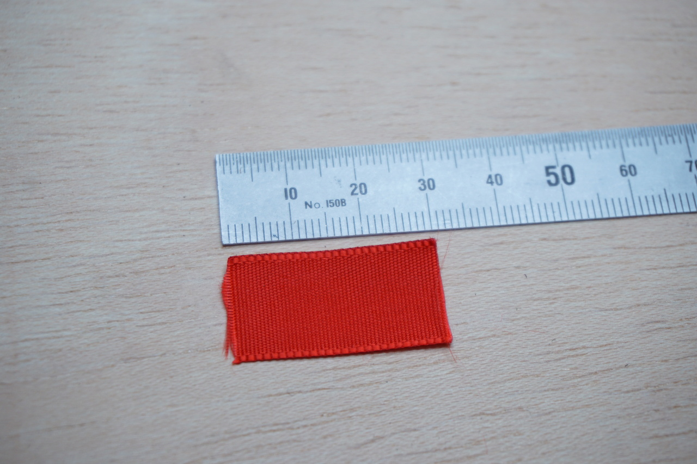

# LED Jewellery

LED modules with momentary buttons for use in illuminated jewellery pieces.  Designed to be used with the 3x AG13 batteries and 2x3x4mm rectangular bipolar LEDs from OptoSupply.

[Onshape CAD model](https://cad.onshape.com/documents/b4da9594c3b7ab582f25c10e/w/f7be495377865d81ba20b8f1/e/7f0067d8441a320d5c97fdeb?configuration=default&renderMode=0&uiState=68a83a7bed6ef7782bf8ab2d)  

  

  

## BOM

| | | |
|---|---|---|
| LED red | bipolar rectangular 2x3x4mm | [TME](https://www.tme.eu/pt/en/details/osrrp27ba1b/tht-leds-rectangle/optosupply/) |
| LED blue | bipolar rectangular 2x3x4mm | [TME](https://www.tme.eu/pt/en/details/osbbs27ba1b/tht-leds-rectangle/optosupply/) |
| LED white | bipolar rectangular 2x3x4mm | [TME](https://www.tme.eu/pt/en/details/osmmd27ba1b/tht-leds-rectangle/optosupply/) |
| batteries | 3x AG13/LR44 | [TME](https://www.tme.eu/pt/en/details/bat-v13_lr44_va/batteries/varta-microbattery/4276-101-511/) |
| resistor | 100R, 0805 | [lcsc](https://lcsc.com/product-detail/Chip-Resistor-Surface-Mount_UNI-ROYAL-0805W8F1000T5E_C17408.html?s_z=n_C17408)
| button | TA3-6R3K-V-T/R | [lcsc](https://lcsc.com/product-detail/Tactile-Switches_Diptronics-TA3-6R3K-V-T-R_C501583.html)
| spring | 0.6x4.5x7.5mm | [aliexpress](https://pt.aliexpress.com/item/1005008224635915.html?spm=a2g0o.order_list.order_list_main.5.102f1802RNEtFH&gatewayAdapt=glo2bra)

[Other suitable LEDs from TME](https://www.tme.eu/pt/en/katalog/tht-leds-rectangle_112903/p,optosupply_120/?params=2586:1461717;2585:1461716;1594:1730052&productListOrderBy=1000013&activeView=parameter)  

## Assembly

  

  

  

  

  

  

  

  

  

  

  

  

  

  

  

  

  

  

  

  

  

  

  

  

  

  
